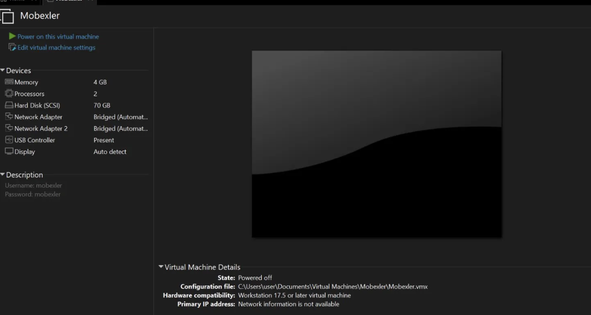
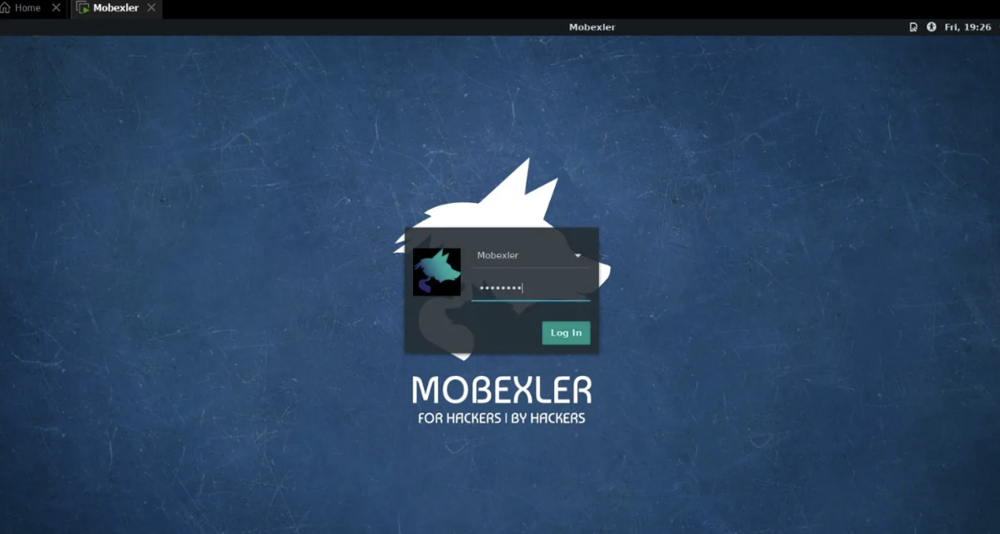
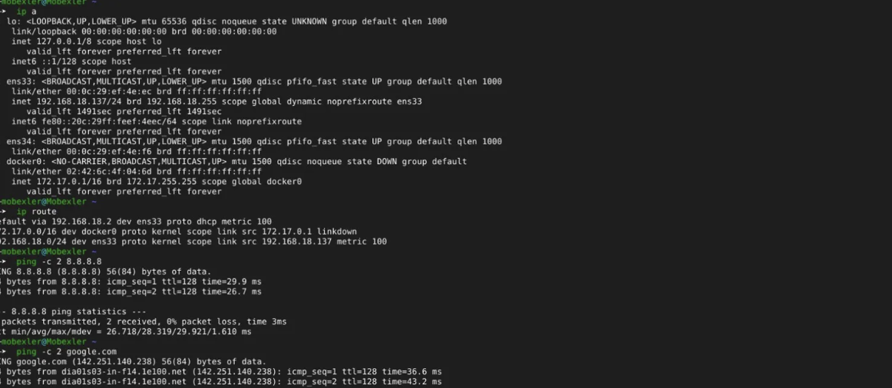
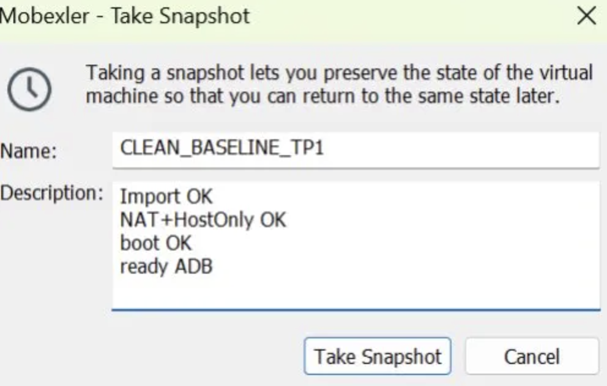
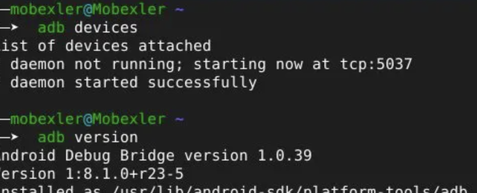

# 🔬 Lab 1 — Mobile Security Environment Setup

**Course:** Mobile Application Security  
**Author:** Yousra Zarri  
**Topic:** Mobexler VM Deployment & Android ADB Configuration

---

## Overview

This writeup documents the full setup of a mobile security lab environment using **Mobexler** — a purpose-built penetration testing distribution for Android and iOS. The goal is to deploy the OVA in a hypervisor, configure dual-network adapters, connect an Android target, and snapshot a clean baseline before any testing begins.

```
[Physical Host]
     ├── VMware / VirtualBox
     │       └── Mobexler (VM)
     │              ├── eth0 → NAT        → Internet
     │              └── eth1 → Host-Only  → Android Target
     └── Android Target (USB or Genymotion emulator)
```

---

## Step 1 — Downloading the OVA

The Mobexler OVA is distributed via Google Drive. Always download from the official project page and never use unverified mirrors.

**Integrity check — SHA256 verification:**

```powershell
# Windows (PowerShell)
Get-FileHash .\Mobexler.ova -Algorithm SHA256
```

```bash
# Linux / macOS
sha256sum Mobexler.ova
```



The hash output should match the value published on the official page. This rules out corrupted downloads (network drops, proxy interference) and confirms the image is exactly the expected version before importing.

**Checklist:**
- [ ] `.ova` file present on disk
- [ ] File size consistent with source
- [ ] SHA256 hash verified

---

## Step 2 — Importing the VM

### VMware Workstation

Import the OVA via **File → Open** or drag-and-drop, then configure two network adapters:

| Adapter | Mode | Purpose |
|---|---|---|
| Network Adapter 1 | NAT | Internet access (updates, tools) |
| Network Adapter 2 | Host-Only / Bridged | Isolated lab network for Android target |



> **VirtualBox alternative:** File → Import Appliance → select the OVA. Then VM → Settings → Network to configure the two adapters. If the Host-Only network isn't listed: Tools → Network Manager → Host-Only Networks → Create.

---

## Step 3 — First Boot & Login

Start the VM and log in with the default credentials:

| Field | Value |
|---|---|
| Username | `mobexler` |
| Password | `mobexler` |



---

## Step 4 — Network Verification

From a terminal inside Mobexler, run the following checks in order.

**List network interfaces:**
```bash
ip a
```
Expected: one interface with a NAT IP (`10.x.x.x` or `192.168.x.x`), one on the Host-Only range.

**Check default route:**
```bash
ip route
```
A `default via ...` line must be present — this is the NAT gateway.

**Test connectivity:**
```bash
ping -c 2 8.8.8.8      # Layer 3 reachability
ping -c 2 google.com   # DNS resolution
```



| Result | Diagnosis | Fix |
|---|---|---|
| Ping IP ✅ / DNS ❌ | DNS misconfiguration | Check `/etc/resolv.conf` |
| No default route | NAT adapter not configured | Reconfigure Adapter 1 as NAT |
| Both fail | Network stack down | Restart VM, verify adapter settings |

**Checklist:**
- [ ] Two interfaces with assigned IPs
- [ ] Default route present
- [ ] `ping 8.8.8.8` succeeds
- [ ] `ping google.com` succeeds (DNS working)

---

## Step 5 — Snapshot: Clean Baseline

Before installing any tools, injecting certificates, or configuring a proxy, create a restore point.

**VMware:** VM → Snapshot → Take Snapshot  
**VirtualBox:** VM → Snapshots → Take

| Field | Value |
|---|---|
| Name | `CLEAN_BASELINE_TP1` |
| Description | `Import OK — NAT+HostOnly OK — Boot OK — Ready ADB` |



This snapshot is the safety net for all subsequent labs. Any TP can modify Mobexler's state — SSL certificates, Burp proxy config, installed tools. Restoring this snapshot brings the system back to a guaranteed clean state in seconds, without reimporting the entire OVA.

**Checklist:**
- [ ] `CLEAN_BASELINE_TP1` visible in snapshot list
- [ ] Restore tested (optional but recommended)

---

## Step 6 — Connecting the Android Target

### Option A — Physical device via USB (recommended)

**Enable Developer Options:**  
Settings → About Phone → tap "Build number" 7 times → Developer Options → USB Debugging: ON

**Pass the USB device to the VM:**
- VMware: Player → Removable Devices → [device name] → Connect
- VirtualBox: Devices → USB → [device name]

**Verify in Mobexler:**
```bash
adb version
adb devices
```

Expected output:
```
List of devices attached
XXXXXXXX    device
```

If the device shows as `unauthorized`, accept the RSA key prompt on the phone. If the list is empty:
```bash
adb kill-server
adb start-server
adb devices
```

### Option B — Genymotion emulator

Genymotion is preferred over Android Studio emulators inside a VM (lower resource overhead). Start the device on the host, note its IP (Host-Only network, e.g. `192.168.56.101`), then from Mobexler:

```bash
adb connect 192.168.56.101:5555
adb devices
```


**Checklist (both options):**
- [ ] `adb devices` shows at least one device in `device` state (not `unauthorized` or empty)

---

## Lab Objectives

By the end of this setup, the environment should support:

- Booting Mobexler cleanly with Internet access via NAT
- Communicating with an Android target over the Host-Only network
- Returning to a known-clean state via `CLEAN_BASELINE_TP1`
- Documenting versions, IPs, ADB state, and proxy config for reproducibility across all future lab sessions

---

## Environment Summary

| Component | Value |
|---|---|
| VM | Mobexler (OVA) |
| Hypervisor | VMware Workstation 17.5 |
| VM RAM | 4 GB |
| VM CPU | 2 cores |
| Disk | 70 GB SCSI |
| ADB version | 1.0.39 (1:8.1.0+r23-5) |
| Snapshot | `CLEAN_BASELINE_TP1` |
